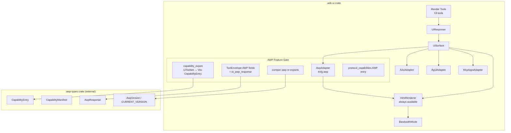

# Design Document: AWP Protocol Alignment

## Overview

This design integrates the Agentic Web Protocol (AWP) into the `adk-ui` crate behind an optional `awp` Cargo feature flag. The integration adds four capabilities:

1. **HTML Renderer** — A new module that converts `UiSurface` component trees into clean, embeddable HTML markup. Available unconditionally (no feature gate) since HTML rendering serves general needs beyond AWP.
2. **AWP Protocol Adapter** — An `AwpAdapter` implementing `UiProtocolAdapter`, producing AWP-compatible JSON payloads containing the component tree and HTML rendering. Gated behind `awp`.
3. **Capability Export** — A method on `UiToolset` that converts enabled render tools into `CapabilityEntry` values from `awp-types`, enabling automatic manifest generation. Gated behind `awp`.
4. **ToolEnvelope AWP Bridge** — Conditional fields (`awp_version`, `request_id`) on `ToolEnvelope` and a conversion method to `AwpResponse`. Gated behind `awp`.
5. **Bandwidth-Adaptive Rendering** — A `BandwidthMode` enum controlling whether the HTML renderer strips non-essential components (Chart, Image, Skeleton, Spinner) and inline styles for constrained connections.
6. **Protocol Capability Metadata** — An "awp" entry in `SUPPORTED_UI_PROTOCOLS` and `UI_PROTOCOL_CAPABILITIES` when the feature is active.

The architectural boundary remains: `adk-awp` decides WHAT to render (HTML vs JSON based on requester type), `adk-ui` decides HOW to render it (component tree → target format).

## Architecture



### Key Design Decisions

1. **HTML renderer is unconditional**: The `build_inline_html()` function in `mcp_apps.rs` produces HTML, but it only dumps raw JSON into a `<pre>` tag — it is not component-aware. The new HTML renderer produces semantic HTML from the typed `Component` enum in `schema.rs`. It lives outside the `awp` gate because MCP Apps and other consumers benefit from real HTML rendering.

2. **Two input paths for HTML rendering**: Render tools produce `UiResponse` with typed `Vec<Component>`. Protocol adapters work with `UiSurface` which stores `Vec<Value>` (raw JSON). The HTML renderer provides both:
   - `render_components_html(&[Component], ...)` — direct typed path, used when you have a `UiResponse`
   - `render_surface_html(&UiSurface, ...)` — deserializes each `Value` into `Component` with best-effort fallback

3. **Component-level HTML mapping**: Each of the 30+ `Component` variants maps to a specific HTML element or structure. This is a pure function: `Component → String`. No external dependencies needed.

3. **BandwidthMode on the renderer, not the adapter**: The renderer accepts `BandwidthMode` as a parameter. The AWP adapter passes it through. This keeps the renderer reusable by non-AWP consumers.

4. **Feature flag follows `adk-core` pattern**: The `awp` feature in `Cargo.toml` gates `awp-types` as an optional dependency. A `src/compat.rs`-style module (`src/awp_compat.rs`) re-exports AWP types when enabled. All AWP-specific code uses `#[cfg(feature = "awp")]`.

5. **Capability export uses existing Tool trait**: Each render tool already implements `name()`, `description()`, and `parameters_schema()`. The capability export maps these directly to `CapabilityEntry` fields.

## Components and Interfaces

### New Files

| File | Purpose | Feature-gated? |
|------|---------|----------------|
| `src/html.rs` | HTML renderer: `render_html(surface, bandwidth_mode) → String` | No |
| `src/interop/awp.rs` | `AwpAdapter` implementing `UiProtocolAdapter` | Yes (`awp`) |
| `src/awp_compat.rs` | Re-exports from `awp-types` + `BandwidthMode` enum | Partially (re-exports gated, `BandwidthMode` always available) |

### Modified Files

| File | Changes |
|------|---------|
| `Cargo.toml` | Add `awp-types` optional dep, `awp` feature |
| `src/lib.rs` | Add `pub mod html`, conditional `pub mod awp_compat`, re-exports |
| `src/compat.rs` | No changes (AWP compat is separate module) |
| `src/interop/mod.rs` | Conditional `pub mod awp`, re-export `AwpAdapter` |
| `src/interop/surface.rs` | Add `Awp` variant to `UiProtocol` enum (conditional) |
| `src/model/envelope.rs` | Add `Awp` variant to `ToolEnvelopeProtocol`, conditional AWP fields on `ToolEnvelope` |
| `src/toolset.rs` | Add `#[cfg(feature = "awp")] pub fn to_capability_entries()` method |
| `src/protocol_capabilities.rs` | Conditional AWP entry in `SUPPORTED_UI_PROTOCOLS`, `UI_PROTOCOL_CAPABILITIES`, `normalize_runtime_ui_protocol` |
| `src/tools/protocol_output.rs` | Add AWP branch to `render_ui_response_with_protocol` |

### Interface: HtmlRenderer (`src/html.rs`)

```rust
/// Bandwidth mode controlling adaptive rendering.
#[derive(Debug, Clone, Copy, PartialEq, Eq, Default)]
#[non_exhaustive]
pub enum BandwidthMode {
    #[default]
    Full,
    Low,
}

/// Options for HTML rendering.
#[derive(Debug, Clone, Default)]
pub struct HtmlRenderOptions {
    pub bandwidth_mode: BandwidthMode,
    /// Optional CSS class prefix to namespace generated classes (e.g. "adk-").
    pub class_prefix: Option<String>,
}

/// Render a UiSurface as embeddable HTML.
///
/// Deserializes each `Value` in `surface.components` into a `Component`.
/// Values that fail deserialization are rendered as `<!-- unknown component -->`.
/// When `options.bandwidth_mode` is `Low`, Chart, Image, Skeleton, and Spinner
/// components are omitted and inline styles are stripped.
/// When `options.class_prefix` is set, all generated CSS classes are prefixed.
pub fn render_surface_html(surface: &UiSurface, options: &HtmlRenderOptions) -> String;

/// Render typed components directly to HTML.
/// Preferred when you have a `UiResponse` with `Vec<Component>`.
pub fn render_components_html(components: &[Component], options: &HtmlRenderOptions) -> String;

/// Render a single Component to an HTML fragment.
/// Internal helper, also useful for testing individual component mappings.
pub(crate) fn render_component_html(component: &Component, mode: BandwidthMode) -> String;

/// Escape user-provided text to prevent HTML injection.
fn escape_html(input: &str) -> String;
```

The public entry points are `render_components_html` (typed path) and `render_surface_html` (Value path). `render_surface_html` iterates over the surface's `Vec<Value>`, attempts to deserialize each into a `schema::Component`, renders successfully deserialized components to HTML via `render_component_html`, and emits `<!-- unknown component -->` for values that fail deserialization. Both functions wrap output in a minimal document shell with only inline styles (no external CSS/JS) to satisfy the embeddability requirement.

### Interface: AwpAdapter (`src/interop/awp.rs`)

```rust
#[cfg(feature = "awp")]
pub struct AwpAdapter {
    bandwidth_mode: BandwidthMode,
    include_html: bool,
    class_prefix: Option<String>,
}

#[cfg(feature = "awp")]
impl AwpAdapter {
    pub fn new() -> Self {
        Self { bandwidth_mode: BandwidthMode::Full, include_html: true, class_prefix: None }
    }
    pub fn with_bandwidth_mode(mut self, mode: BandwidthMode) -> Self { self.bandwidth_mode = mode; self }
    pub fn with_include_html(mut self, include: bool) -> Self { self.include_html = include; self }
    pub fn with_class_prefix(mut self, prefix: impl Into<String>) -> Self { self.class_prefix = Some(prefix.into()); self }
}

#[cfg(feature = "awp")]
impl UiProtocolAdapter for AwpAdapter {
    fn protocol(&self) -> UiProtocol { UiProtocol::Awp }
    
    fn to_protocol_payload(&self, surface: &UiSurface) -> Result<Value, AdkError> {
        let mut payload = json!({
            "protocol": "awp",
            "surface_id": surface.surface_id,
            "components": surface.components,
        });
        if self.include_html {
            let options = HtmlRenderOptions {
                bandwidth_mode: self.bandwidth_mode,
                class_prefix: self.class_prefix.clone(),
            };
            let html = render_surface_html(surface, &options);
            payload["html"] = json!(html);
        }
        Ok(payload)
    }
}
```

### Interface: Capability Export (`src/toolset.rs` addition)

```rust
#[cfg(feature = "awp")]
impl UiToolset {
    /// Export enabled tools as AWP CapabilityEntry values.
    ///
    /// Uses the per-tool include flags (include_screen, include_form, etc.)
    /// to determine which tools to export. Does not require a ReadonlyContext.
    pub fn to_capability_entries(&self) -> Vec<awp_types::CapabilityEntry> {
        // Builds the same tool list as Toolset::tools() but without
        // requiring an async context or ReadonlyContext parameter.
        // For each enabled tool, creates a CapabilityEntry from
        // tool.name(), tool.description(), tool.parameters_schema().
    }
}
```

### Interface: ToolEnvelope AWP Bridge (`src/model/envelope.rs` additions)

```rust
// ToolEnvelopeProtocol gains a conditional variant:
#[cfg(feature = "awp")]
Awp,

// ToolEnvelope gains conditional fields:
#[cfg(feature = "awp")]
#[serde(skip_serializing_if = "Option::is_none")]
pub awp_version: Option<String>,

#[cfg(feature = "awp")]
#[serde(skip_serializing_if = "Option::is_none")]
pub request_id: Option<String>,

// ToolEnvelope gains a conditional conversion method:
#[cfg(feature = "awp")]
impl<P: Serialize> ToolEnvelope<P> {
    pub fn to_awp_response(&self) -> Result<awp_types::AwpResponse, AdkError> { ... }
}
```

### Interface: UiProtocol Enum Extension

```rust
// In src/interop/surface.rs, UiProtocol gains:
#[cfg(feature = "awp")]
Awp,
```

### Interface: Protocol Capabilities Extension

When `awp` is enabled:
- `normalize_runtime_ui_protocol` recognizes `"awp"` as a valid alias
- A public `AWP_PROTOCOL_CAPABILITY` constant of type `UiProtocolCapabilitySpec` is exposed
- Downstream crates (adk-server, adk-gateway) are responsible for including this constant in their runtime protocol arrays — adk-ui does NOT modify `SUPPORTED_UI_PROTOCOLS` or `UI_PROTOCOL_CAPABILITIES`

### HTML Component Mapping

| Component | HTML Output |
|-----------|-------------|
| `Text` (Body) | `<p>` |
| `Text` (H1-H4) | `<h1>`–`<h4>` |
| `Text` (Caption) | `<small>` |
| `Text` (Code) | `<code>` |
| `Button` | `<button>` with `data-action-id` |
| `Icon` | `<span class="icon" data-icon="{name}">` |
| `Image` | `` (omitted in Low bandwidth) |
| `Badge` | `<span class="badge badge-{variant}">` |
| `TextInput` | `<label>` + `<input type="text">` |
| `NumberInput` | `<label>` + `<input type="number">` |
| `Select` | `<label>` + `<select>` with `<option>` children |
| `MultiSelect` | `<label>` + `<select multiple>` |
| `Switch` | `<label>` + `<input type="checkbox" role="switch">` |
| `DateInput` | `<label>` + `<input type="date">` |
| `Slider` | `<label>` + `<input type="range">` |
| `Textarea` | `<label>` + `<textarea>` |
| `Stack` (vertical) | `<div class="stack stack-vertical">` |
| `Stack` (horizontal) | `<div class="stack stack-horizontal">` |
| `Grid` | `<div class="grid" style="grid-template-columns: repeat(N, 1fr)">` |
| `Card` | `<div class="card">` with `<h3>` title, content div, footer div |
| `Container` | `<div class="container">` |
| `Divider` | `<hr>` |
| `Tabs` | `<div class="tabs">` with tab buttons and content panels |
| `Table` | `<table>` with `<thead>` and `<tbody>` |
| `List` (ordered) | `<ol>` with `<li>` items |
| `List` (unordered) | `<ul>` with `<li>` items |
| `KeyValue` | `<dl>` with `<dt>`/`<dd>` pairs |
| `CodeBlock` | `<pre><code>` |
| `Chart` | `<div class="chart-placeholder" data-chart="{json}">` (omitted in Low) |
| `Alert` | `<div class="alert alert-{variant}" role="alert">` |
| `Progress` | `<progress value max="100">` |
| `Toast` | `<div class="toast toast-{variant}">` |
| `Modal` | `<dialog>` with title and content |
| `Spinner` | `<div class="spinner" role="status">` (omitted in Low) |
| `Skeleton` | `<div class="skeleton">` (omitted in Low) |

## Data Models

### BandwidthMode

```rust
#[derive(Debug, Clone, Copy, PartialEq, Eq, Default, Serialize, Deserialize)]
#[serde(rename_all = "snake_case")]
#[non_exhaustive]
pub enum BandwidthMode {
    #[default]
    Full,
    Low,
}
```

Defined in `src/html.rs` (always available). Marked `#[non_exhaustive]` so a `Medium` variant can be added later without breaking consumers. Controls which components are rendered and whether inline styles are included.

### AWP Adapter Payload Shape

The `AwpAdapter::to_protocol_payload` produces:

```json
{
  "protocol": "awp",
  "surface_id": "main",
  "components": [ /* original component tree as JSON values */ ],
  "html": "<div class=\"stack stack-vertical\">..."
}
```

### ToolEnvelope with AWP Fields (when `awp` enabled)

```json
{
  "protocol": "awp",
  "version": "1.0",
  "surface_id": "main",
  "awp_version": "1.0",
  "request_id": "req-abc-123",
  "payload_field": "..."
}
```

The `awp_version` and `request_id` fields are `Option<String>`, serialized only when present.

### CapabilityEntry Mapping

Each render tool maps to a `CapabilityEntry`:

```rust
CapabilityEntry {
    name: tool.name().to_string(),           // e.g. "render_card"
    description: tool.description().to_string(),
    endpoint: format!("/tools/{}", tool.name()),
    method: "POST".to_string(),
    input_schema: tool.parameters_schema().map(|v| v.to_string()),
    output_schema: None,
}
```

### AWP Protocol Capability Spec

```rust
UiProtocolCapabilitySpec {
    protocol: "awp",
    versions: &["1.0"],
    implementation_tier: UiProtocolImplementationTier::CompatibilitySubset,
    spec_track: UiProtocolSpecTrack::Draft,
    summary: "AWP-aligned HTML rendering with capability manifest export and bandwidth-adaptive output.",
    features: &[
        "html_rendering",
        "capability_manifest_export",
        "bandwidth_adaptive",
        "tool_envelope_bridge",
    ],
    limitations: &[
        "HTML renderer produces static markup; interactive behaviors require client-side hydration.",
        "Chart components render as data-attribute placeholders, not visual charts.",
    ],
    deprecation: None,
}
```

## Correctness Properties

*A property is a characteristic or behavior that should hold true across all valid executions of a system — essentially, a formal statement about what the system should do. Properties serve as the bridge between human-readable specifications and machine-verifiable correctness guarantees.*

### Property 1: Component-to-HTML mapping correctness

*For any* valid `Component` value (across all 30+ variants with arbitrary field values), the HTML renderer SHALL produce an HTML string containing the correct HTML element type for that component variant (e.g., Text/Body → `<p>`, Button → `<button>`, Table → `<table>`, Alert → `<div role="alert">`, Progress → `<progress>`, form inputs → corresponding `<input>`/`<select>`/`<textarea>` elements) and the component's user-visible content (label, text, title, etc.) SHALL appear in the output.

**Validates: Requirements 2.2, 2.3, 2.4, 2.5, 2.6, 2.7, 2.8, 2.9, 2.10**

### Property 2: HTML injection prevention

*For any* string containing HTML special characters (`<`, `>`, `&`, `"`, `'`), when that string is used as text content in a Component and rendered to HTML, the output SHALL contain the escaped form of those characters (e.g., `&lt;`, `&gt;`, `&amp;`, `&quot;`, `&#x27;`) and SHALL NOT contain the raw unescaped characters in text positions.

**Validates: Requirements 2.12**

### Property 3: Embeddable HTML output

*For any* valid `UiSurface`, the HTML output from `render_surface_html` SHALL NOT contain `<link rel="stylesheet"` tags, external `<script src=` references, or `@import` CSS rules — ensuring the output is self-contained and embeddable.

**Validates: Requirements 2.11**

### Property 4: AWP adapter payload completeness

*For any* valid `UiSurface`, when converted via `AwpAdapter::to_protocol_payload`, the resulting JSON value SHALL contain a `"protocol"` field equal to `"awp"`, a `"surface_id"` field matching the surface's `surface_id`, a `"components"` array, and an `"html"` string that is non-empty.

**Validates: Requirements 3.2**

### Property 5: Capability entry completeness

*For any* render tool in the `UiToolset`, when converted to a `CapabilityEntry`, the entry SHALL have a non-empty `name` matching the tool's `name()`, a non-empty `description`, and a `Some` value for `input_schema`.

**Validates: Requirements 4.2**

### Property 6: Disabled tool exclusion from capability export

*For any* `UiToolset` configuration where one or more tools are disabled, the `to_capability_entries()` result SHALL NOT contain entries whose `name` matches any disabled tool, and the count of entries SHALL equal the number of enabled tools.

**Validates: Requirements 4.4**

### Property 7: Full bandwidth preserves all components

*For any* valid `UiSurface` containing N components, rendering with `BandwidthMode::Full` SHALL produce HTML where every component has a corresponding HTML representation in the output (no components are omitted).

**Validates: Requirements 5.2**

### Property 8: Low bandwidth omits bandwidth-sensitive components

*For any* `UiSurface` containing Chart, Image, Skeleton, or Spinner components, rendering with `BandwidthMode::Low` SHALL produce HTML that does NOT contain the HTML representations of those component types (no ``, no `data-chart`, no `class="spinner"`, no `class="skeleton"`).

**Validates: Requirements 5.3, 5.4, 5.5**

### Property 9: Low bandwidth strips inline styles

*For any* valid `UiSurface`, rendering with `BandwidthMode::Low` SHALL produce HTML that does NOT contain `style="` attributes on any element.

**Validates: Requirements 5.6**

### Property 10: ToolEnvelope AWP response conversion

*For any* `ToolEnvelope` with a serializable payload and `awp_version` set, calling `to_awp_response()` SHALL produce a valid `AwpResponse` without error.

**Validates: Requirements 6.2**

### Property 11: Existing adapter backward compatibility

*This property is verified via CI matrix testing rather than property-based testing*, because comparing output with and without a feature flag requires two separate compilation targets. The CI pipeline should run `cargo test` (without `awp`) and `cargo test --features awp` and verify both pass with identical adapter output for the same inputs. A unit test within the `awp`-enabled build can verify that the three existing adapters produce the expected output shapes, but cross-feature comparison is a CI concern.

**Validates: Requirements 8.3**

## Error Handling

### HTML Renderer Errors

The HTML renderer is designed to never fail:
- `render_components_html` is a pure function over typed `Component` values — infallible.
- `render_surface_html` deserializes `Vec<Value>` into `Component`. Values that fail `serde_json::from_value::<Component>()` are:
  - Skipped in the output
  - Replaced with an HTML comment `<!-- unknown component -->`
  - Remaining components continue rendering normally

This fail-soft approach ensures partial rendering rather than total failure. It also handles the case where `UiSurface` contains A2UI-format components (nested `component` objects) that don't match the flat `schema::Component` format — those will be rendered as unknown components rather than causing a panic.

### AWP Adapter Errors

`AwpAdapter::to_protocol_payload` returns `Result<Value, AdkError>`. Errors occur when:
- HTML rendering produces an empty string (should not happen with valid surfaces)
- JSON serialization of the payload fails

These propagate as `AdkError::Tool` with descriptive messages.

### Capability Export Errors

`to_capability_entries()` returns `Vec<CapabilityEntry>` (infallible). Tools that return `None` for `parameters_schema()` will have `input_schema: None` in their `CapabilityEntry`.

### ToolEnvelope Conversion Errors

`to_awp_response()` returns `Result<AwpResponse, AdkError>`. Errors occur when:
- The payload cannot be serialized to JSON
- Required AWP fields (`awp_version`) are not set

### Feature Flag Isolation

All AWP-specific error paths are behind `#[cfg(feature = "awp")]`. When the feature is disabled, no AWP error paths exist in the compiled binary.

## Testing Strategy

### Unit Tests (Example-Based)

Unit tests cover specific examples, edge cases, and integration points:

- **Feature flag smoke tests**: Verify compilation with and without `awp` feature
- **AWP compat re-exports**: Verify `CapabilityEntry`, `AwpResponse`, etc. are accessible
- **AwpAdapter construction**: Verify `protocol()` returns `Awp`
- **UiProtocol::Awp variant**: Verify enum variant exists
- **Protocol capabilities**: Verify `SUPPORTED_UI_PROTOCOLS` contains "awp", `normalize_runtime_ui_protocol("awp")` returns `Some("awp")`
- **ToolEnvelope AWP fields**: Verify serialization includes `awp_version` and `request_id`
- **BandwidthMode default**: Verify default is `Full`
- **Empty surface rendering**: Verify renderer handles empty component list
- **Backward compatibility regression**: Run all 93 existing tests with and without `awp`

### Property-Based Tests

Property-based testing is appropriate for this feature because the HTML renderer is a pure function with clear input/output behavior, the input space (arbitrary component trees) is large, and universal properties (escaping, element mapping, bandwidth filtering) hold across all inputs.

**Library**: `proptest` (standard Rust PBT library)

**Configuration**: Minimum 100 iterations per property test.

**Tag format**: `Feature: awp-protocol-alignment, Property {N}: {title}`

Each correctness property (1–11) maps to a single property-based test:

1. **Property 1 test**: Generate arbitrary `Component` variants, render, assert correct HTML element type and content presence.
2. **Property 2 test**: Generate strings with HTML special characters, embed in Text component, render, assert escaped output.
3. **Property 3 test**: Generate arbitrary `UiSurface`, render, assert no external resource references.
4. **Property 4 test**: Generate arbitrary `UiSurface`, convert via `AwpAdapter`, assert payload fields.
5. **Property 5 test**: Iterate all 13 tools, convert each to `CapabilityEntry`, assert fields populated.
6. **Property 6 test**: Generate random boolean vectors for tool enable/disable, create `UiToolset`, assert entry count matches enabled count.
7. **Property 7 test**: Generate arbitrary `UiSurface`, render in Full mode, assert all components represented.
8. **Property 8 test**: Generate surfaces with bandwidth-sensitive components, render in Low mode, assert those components absent.
9. **Property 9 test**: Generate arbitrary `UiSurface`, render in Low mode, assert no `style=` attributes.
10. **Property 10 test**: Generate `ToolEnvelope` with random payloads and `awp_version` set, call `to_awp_response()`, assert Ok.
11. **Property 11 test**: Generate arbitrary `UiSurface`, run through existing adapters, compare output structure.
