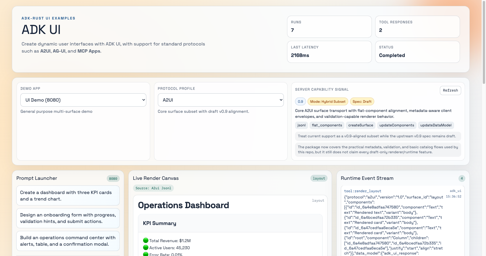
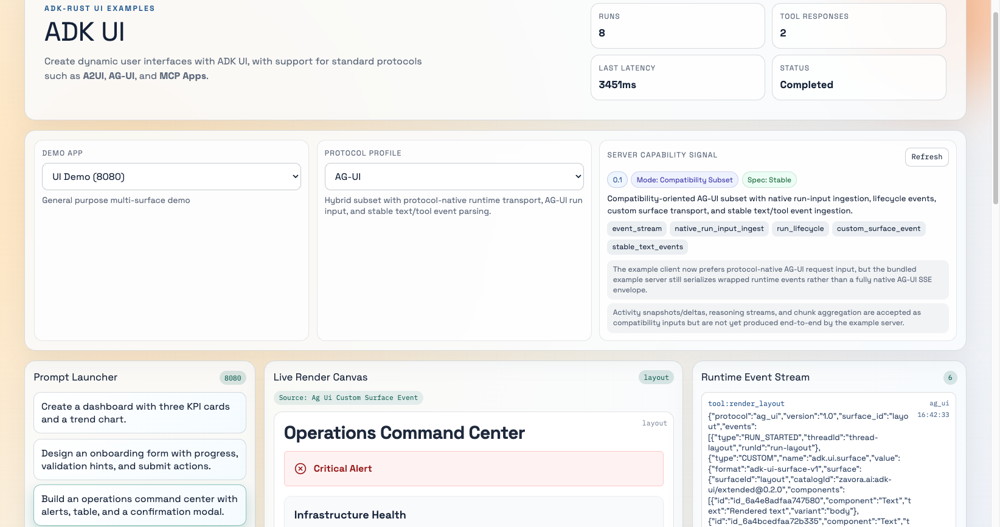
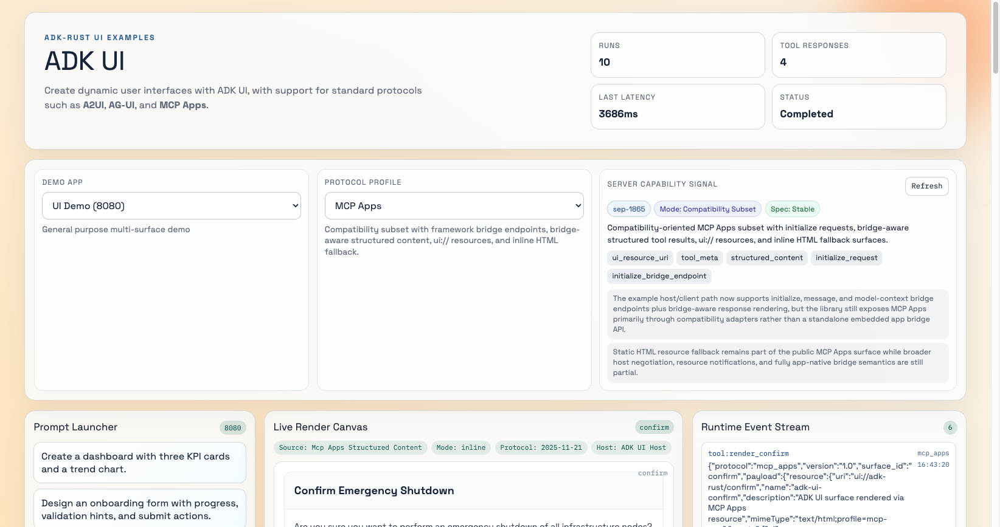

# adk-ui

Dynamic UI generation for [ADK-Rust](https://adk-rust.com) agents — render forms, cards, tables, charts, and more.

`adk-ui` provides AI agents with a structured UI vocabulary: forms, dashboards, confirmations, alerts, tables, charts, progress indicators, modals, toasts, and protocol-aware surfaces that real clients can render. If your agent can reason about a workflow, `adk-ui` helps it express that workflow as an interface people can use.

[](https://crates.io/crates/adk-ui)
[](https://docs.rs/adk-ui)
[](LICENSE)

## Why adk-ui?

- **Structured agentic UI** — give agents high-level render tools instead of hand-authoring frontend code.
- **Protocol-honest boundaries** — A2UI, AG-UI, and MCP Apps are supported with explicit capability signaling, not vague compatibility claims.
- **Ship faster** — includes a Rust demo server, a React reference client, protocol adapters, examples, tests, and migration docs.
- **Keep the loop agentic** — the same system can request input, render results, ask for confirmation, and react to follow-up actions.
- **Grow without rewriting** — start with high-level tools, then choose the protocol surface that matches your host or client architecture.

## Screenshots

### A2UI Dashboard



### AG-UI Operations Flow



### MCP Apps Confirm Flow



## What You Can Build

- A **support intake assistant** that turns open-ended requests into structured forms, triage queues, and escalation confirmations.
- An **operations agent** that renders dashboards, alerts, and approval prompts instead of dumping raw JSON into chat.
- A **scheduling assistant** that shows availability, collects preferences, and confirms bookings.
- An **inventory or facilities workflow** that moves from dashboard → form → approval → toast in a single agent session.

## Quick Start

### 1. Add the dependency

```toml
[dependencies]
adk-ui = "0.7"
```

### 2. Register the UI toolset with your agent

```rust
use adk_agent::LlmAgentBuilder;
use adk_ui::{UiToolset, UI_AGENT_PROMPT};

let tools = UiToolset::all_tools();

let mut builder = LlmAgentBuilder::new("assistant")
    .model(model)
    .instruction(UI_AGENT_PROMPT);

for tool in tools {
    builder = builder.tool(tool);
}

let agent = builder.build()?;
```

### 3. Run the example stack

The bundled demo pairs the Rust example server with the React client.

```bash
# Install dependencies from the repo root
npm install

# Start the Rust example server
export GOOGLE_API_KEY=...
cargo run --example ui_server --features adk-core
```

```bash
# In a second terminal
cd examples/ui_react_client
npm run dev -- --host 127.0.0.1
```

Open [http://127.0.0.1:5173/](http://127.0.0.1:5173/), choose a protocol profile, and run one of the built-in prompts.

> The repo uses npm workspaces, so the React example and the shared renderer package install together from the root. A fresh clone should start with `npm install` at the top level.

## Generative UI Concept

`adk-ui` is a UI layer for agents, not a replacement web framework.

Your agent decides:

1. What the user needs next
2. Which UI pattern fits the moment
3. What data to show or collect
4. What action should follow the user's response

`adk-ui` gives the agent structured tools to express those decisions safely. A single conversation can naturally move through:

1. A prompt from the user
2. A rendered form or dashboard
3. A follow-up action (confirm, submit, retry)
4. A new surface, update, or toast

## Agentic UI Examples

### Support Intake

> *"My payroll export failed and finance needs it today."*

The agent renders a support intake form with severity, environment, screenshots, and deadline fields — summarizes the issue back to the user — then asks for confirmation before escalating to the on-call queue.

### Operations Command Center

> *"Show me cluster health and let me approve a failover if needed."*

The agent renders a dashboard with alerts, node tables, and traffic charts — surfaces a confirmation card for risky actions — then renders a toast or status panel after approval.

### Scheduling Assistant

> *"Book me the earliest available appointment next week."*

The agent shows available time slots — collects preferences or missing constraints — confirms the selection — then renders a success state with the booked details.

## Supported Protocols

`adk-ui` supports three protocol surfaces, each designed for a different integration boundary:

| Protocol | Best For |
|----------|----------|
| **A2UI** | Direct structured surface transport between agent/server and renderer. Cleanest starting point. |
| **AG-UI** | Consumers that need event streams, lifecycle updates, and stable message/tool semantics. |
| **MCP Apps** | Host/app bridge integrations with `ui://` resources, structured content, and bridge-aware metadata. |
| **AWP** | Agentic Web Protocol — dual-user rendering with HTML output, capability manifest export, and bandwidth-adaptive mode. Requires `awp` feature flag. |

A legacy `adk_ui` profile remains available for backward compatibility during migration. New integrations should use `a2ui`, `ag_ui`, or `mcp_apps`.

### Choosing the Right Protocol

- Start with **A2UI** for the most direct structured surface path.
- Use **AG-UI** when the consumer wants event semantics.
- Use **MCP Apps** when the host/app bridge model matters.
- Use **AWP** when you need dual-user rendering (HTML for humans, structured data for agents) with bandwidth-adaptive output.

If unsure, start with A2UI, validate the user journey, then introduce AG-UI, MCP Apps, or AWP at the boundary that needs them.

### AWP Feature Flag

AWP integration is behind an optional Cargo feature flag:

```toml
[dependencies]
adk-ui = { version = "0.7", features = ["awp"] }
```

This adds the `AwpAdapter`, HTML renderer with `BandwidthMode`, capability manifest export via `UiToolset::to_capability_entries()`, and `ToolEnvelope` AWP bridge fields. Without the flag, adk-ui compiles without any AWP dependencies.

## Compliance Snapshot

This section is deliberately concrete to help integrators understand what is implemented today.

### Implementation Metrics

| Metric | Value |
|--------|-------|
| Component types | 30 |
| High-level render tools | 13 |
| Render tool × protocol combinations tested | 39 / 39 |
| Runtime profiles smoke-tested in live client | 5 / 5 (as of 2026-04-25) |
| Runtime capability metadata | Exposed via `/api/ui/capabilities` |

### Protocol Support

| Protocol | Upstream Target | Tier | What Works Today | Live Validation |
|----------|----------------|------|------------------|-----------------|
| `a2ui` | `v0.9` draft-aligned | Hybrid subset | JSONL, flat components, `createSurface`, `updateComponents`, `updateDataModel`, client metadata, validation feedback, local actions | Dashboard render validated in browser |
| `ag_ui` | Stable `0.1` subset | Compatibility subset | Native run-input ingestion, run lifecycle, stable text/tool event ingestion, message snapshot ingestion, action loop support in React client | Render + confirm action validated in browser |
| `mcp_apps` | `SEP-1865` subset | Compatibility subset | `ui://` resources, structured tool results, initialize/message/model-context bridge endpoints, host context, inline HTML fallback | Initialize + render + confirm action validated in browser |
| `adk_ui` | Internal legacy | Legacy | Backward-compatible runtime behavior during migration | Tested in browser |
| `awp` | AWP v1.0 | Compatibility subset | HTML rendering from typed components, capability manifest export, bandwidth-adaptive mode, ToolEnvelope bridge | Dashboard + form + command center validated in browser |

> **Honesty note:** `adk-ui` does not present AG-UI or MCP Apps as fully native or complete implementations. Runtime capability signals and documentation are intentionally explicit about hybrid and compatibility subsets so downstream clients can make informed decisions.

## Architecture

```text
User prompt
  → Agent decides what UI to render
  → adk-ui tool emits a surface or protocol-aware payload
  → Client renders the surface
  → User acts on the interface
  → Action routes back to the agent
  → Agent updates, confirms, or completes the workflow
```

This repo includes:

- Rust-side UI models, validation, prompts, templates, and protocol adapters
- A React reference client that renders and acts on agent-produced surfaces
- Protocol boundary code for A2UI, AG-UI, and MCP Apps
- Tests and examples for real integration paths

## Render Tools

| Tool | Purpose |
|------|---------|
| `render_screen` | Emit protocol-aware screen surfaces from component definitions |
| `render_page` | Build multi-section pages with protocol-aware payloads |
| `render_kit` | Generate A2UI kit/catalog artifacts |
| `render_form` | Collect structured user input |
| `render_card` | Display information-rich cards with actions |
| `render_alert` | Surface status and severity messages |
| `render_confirm` | Request user approval for risky or important actions |
| `render_table` | Display sortable tabular data |
| `render_chart` | Display line, bar, area, and pie charts |
| `render_layout` | Build dashboard-style layouts |
| `render_progress` | Show progress and step flows |
| `render_modal` | Display modal dialogs |
| `render_toast` | Show temporary notifications |

### Core Strengths

- Type-safe Rust schema with TypeScript-friendly rendering surface
- Server-side validation before bad UI reaches the browser
- Streaming updates via `UiUpdate`
- HTML renderer for all 30+ component types with bandwidth-adaptive output
- Tested system prompts for reliable tool use
- Prebuilt templates for common business flows
- Protocol adapters that reduce per-tool drift

## Examples

| Example | Description | Command |
|---------|-------------|---------|
| `ui_server` | Rust server with SSE and protocol-aware UI tool output | `cargo run --example ui_server --features adk-core` |
| `ui_react_client` | React reference client with protocol profile selector | `cd examples/ui_react_client && npm run dev -- --host 127.0.0.1` |

Protocol coverage and streaming behaviors are exercised through the live React client and the Rust test suite in [`/tests`](tests/).

## Migration and Deprecation

The legacy `adk_ui` runtime profile is on a planned migration path:

| Milestone | Date |
|-----------|------|
| Announced | 2026-02-07 |
| Sunset target | 2026-12-31 |
| Preferred profiles | `a2ui`, `ag_ui`, `mcp_apps` |

See [docs/PROTOCOL_MIGRATION.md](docs/PROTOCOL_MIGRATION.md) for detailed guidance.

## Additional Documentation

- [Protocol Migration Guide](docs/PROTOCOL_MIGRATION.md)
- [Protocol Modernization Workplan](docs/PROTOCOL_MODERNIZATION_WORKPLAN.md)
- [Framework Continuity Roadmap](docs/FRAMEWORK_CONTINUITY_ROADMAP.md)
- [React Client Notes](examples/ui_react_client/README.md)

## License

Apache-2.0

## Part of ADK-Rust

`adk-ui` is part of the [ADK-Rust](https://adk-rust.com) ecosystem for building AI agents in Rust.
